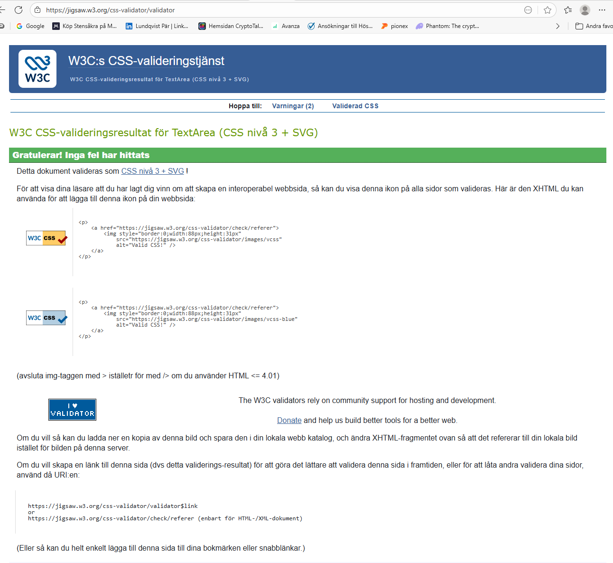
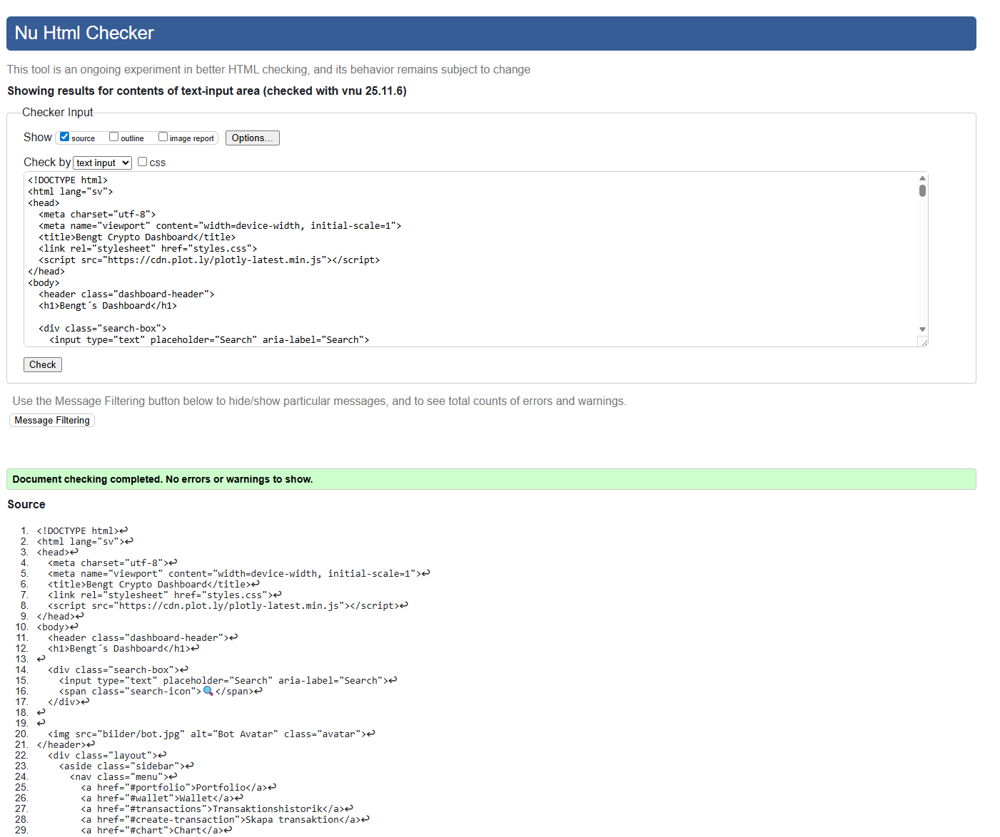
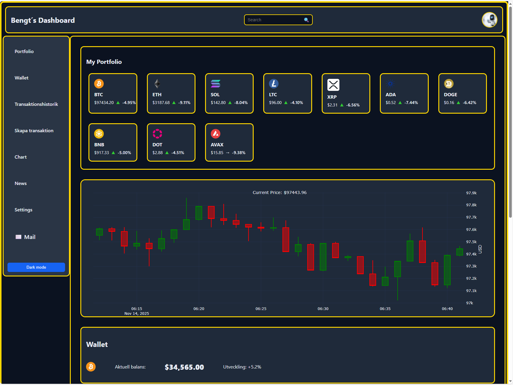

# Inlämningsuppgift
Här är repot för din inlämningsuppgift.

I den finns just nu endast en `.gitignore`-fil, som exkluderar vissa systemfiler från att komma med i versionshanteringen.

Ändamålet med denna uppgift har varit att skapa en responsiv dashboard som fungerar på olika enheter och skärmstorlekar, från mobil till stora desktopskärmar. Genom att bygga en sida med logotyp, navigation och sektioner för wallet, transaktionshistorik och ett formulär för att skapa transaktioner tränar man på att kombinera HTML och CSS med fokus på struktur, tillgänglihet och användarvänlighet. Projektet ger också erfarenhet av att arbeta med ankarlänkar för smidig navigering, tabeller och formulär med tydlig interaktion samt stöd för mörkt och ljust läge. Syftet är att utveckla en helhetssida som inte bara fungerar tekniskt utan också är tillgänglig, responsiv och presentabel, och som jag kan använda för att visa upp mina kunskaper för en LIA plats eller framtida arbetsgivare.
Det har varit ett lärorikt projekt och den som säger att det bara är å fylla på med en massa kod eller bara att använda chat GPT  eller liknande han vet inte vad han pratar om för det måste alltid till egen handpåläggning för att det ska bli bra i slutet. 